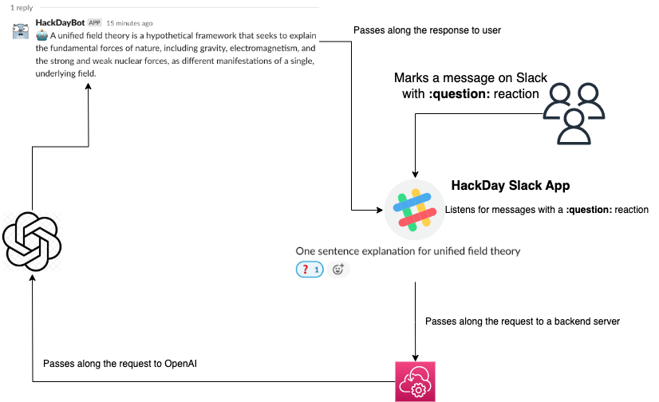

# Hackday project

## Outline

1. Goals
    * [Basic understanding of GPT language model (text/chat completions)](#gpt-notes)
    * Apply
        * Clone ChatGPT
        * [HackDayBot](#hackdaybot)
2. Stretch goal
    * Image generation (DALL-E)
3. Apply
4. What's Next
    * Fine-tunning a model
    * Training a neural network on private data
5. Resources
    * [OpenAI Research Index](https://openai.com/research)
    * [GPT Research paper](https://s3-us-west-2.amazonaws.com/openai-assets/research-covers/language-unsupervised/language_understanding_paper.pdf)
    * [Attention is all you need](https://arxiv.org/abs/1706.03762)
    * [Language models are Few-Shot learners](https://arxiv.org/pdf/2005.14165.pdf)
    * [Zero-Shot Text-to-Image Generation](https://arxiv.org/abs/2102.12092)

### GPT notes

* *Generative Pre-trained Transformer* is an *autoregressive* language model
    * **Autoregressive** - in this context means that the model predicts the next word by looking at the previous words in a sequence

* Fundamentally, GPT language model takes an input text(tokens) and outputs some amount of text(tokens). There are limits on how much the model can ingest to get the desired output

* Jargon
    * **Text completion** - Here, a model is expected to generate & predict what comes next in a sentence
    * **Chat completion** - Similar to text completion but with an expectation of remembering context of chat history
    * **Loss Error** - measurement or being able to measure how wrong a specific word is in terms of the context
    * **Context Window** - essentially the number of tokens (input + output combined) GPT-4 allows 32,768 tokens as max tokens. Context window gives a sense of that the model has a memory
    * **Vectorization** or **Words to Vec**
        * An error loss can't be computed between two words but we can calculate the difference between two vectors
        * Text is converted to tokens and tokens are encoded into vectors
        * An embedding neural network is used to convert the tokens into a vector.
        * Each vector has dimensions (or features) that distinguish it from other vectors. GPT-3 initially used a 12,288 dimension vector
    * **Temperature**
        * OpenAI model specific parameter that provides outputs based on probability distributions of the predicted tokens
        * Increase the temperature to get more random results
        * Decrease the temperature to get accurate results

* Training data
    * For GPT models, this is text available on the internet
    * Models scrape the internet to create training data
    * Example: *I ran across the street to get home*
        * Training data = Sets of words + Label for prediction
        * Example:
            * Context windows below are 5 tokens [4 input tokens for a 1 token prediction]
            * *Context Window 1*: ["I ran across the", "street"]
            * *Context Window 2*: ["ran across the street", "to"]
            * *Context Window 3*: ["across the street to", "get"]

GPT-3 had 175 billion parameters, in terms of storage - 800GB. Costs about $4.6 million dollars to train in GPU costs

### HackDayBot

A simple slack application that can act as ChatGPT.
